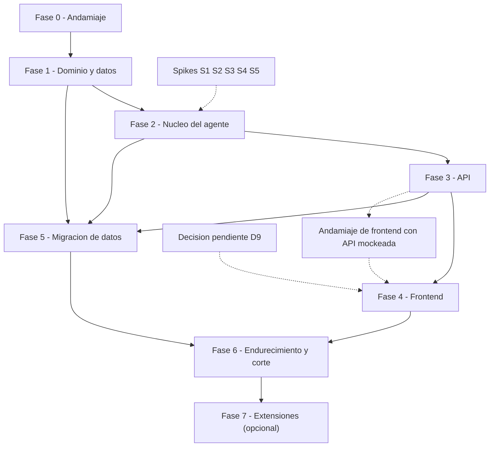

# Plan de Desarrollo — `theyrethink-ai`

> **Qué es este documento.** La capa de **ejecución**: fases, tareas, entregables,
> criterios de "hecho" (DoD), gates de entrada y secuencia. No duplica arquitectura:
> el "qué" y el "por qué" viven en [`REWRITE_PROPOSAL.md`](./REWRITE_PROPOSAL.md).
>
> **Fuente de referencia funcional:** `theythink-ai` (solo lectura). Cada decisión de
> arquitectura está marcada `A#` en la propuesta §3; cada decisión abierta `D#` en §14.
>
> Estado: **plan vivo** — se actualiza al cerrar cada fase y cada decisión.

---

## 0. Cómo se trabaja

- **Fases secuenciales con gates.** No se abre una fase hasta que la anterior cumple su
  DoD. Excepción explícita: el andamiaje del frontend (Fase 4) puede arrancar en paralelo
  contra una API **mockeada** una vez congelado el OpenAPI de `auth`/`threads`/`chat`
  (a finales de Fase 3).
- **Rebanadas verticales.** Cada fase entrega algo demostrable de punta a punta, no una
  capa horizontal a medias.
- **Troncal corto.** Ramas de vida corta, PRs pequeños, CI verde como precondición.
- **Nada de trabajo "de fondo" invisible.** Si una tarea no tiene forma de verificarse,
  se reescribe como tarea verificable o se descarta.
- **Las decisiones no se toman en el código.** Si aparece una decisión nueva, se registra
  aquí (§3) y se resuelve **antes** de la fase que bloquea.

### Registro de estado

| Fase | Nombre | Estado | DoD cumplido |
|---|---|---|---|
| 0 | Andamiaje | ✅ cerrada | ✅ |
| 1 | Dominio y datos | ⬜ pendiente | ⬜ |
| 2 | Núcleo del agente | ⬜ pendiente | ⬜ |
| 3 | API | ⬜ pendiente | ⬜ |
| 4 | Frontend | ⬜ pendiente | ⬜ |
| 5 | Migración de datos | ⬜ pendiente | ⬜ |
| 6 | Endurecimiento y corte | ⬜ pendiente | ⬜ |
| 7 | Extensiones | ⬜ opcional | ⬜ |

Leyenda: ⬜ pendiente · 🔵 en curso · ✅ cerrada.

---

## 1. Definición de "listo" (DoR) y de "hecho" (DoD)

**DoR — una tarea puede empezar cuando:**

- Su dependencia de decisiones está resuelta (§3) o explícitamente diferida.
- Tiene una verificación observable (test, comando, curl, snapshot).
- Está claro qué archivos toca y qué no.

**DoD global (extiende la propuesta §15):**

1. Respeta las decisiones `A#` de la propuesta §3.
2. Tiene tests: unitarios del núcleo **sin I/O real** (LLM falso, `InMemorySaver`,
   `InMemoryStore`, cola falsa) y de contrato para endpoints.
3. **`langgraph` / `langchain` no se importan fuera de `app/agent/`** — verificado por
   `import-linter` en CI, no por revisión manual.
4. Lint y typecheck en verde.
5. Ningún endpoint mutador sin autorización; ningún secreto con valor por defecto.
6. Ningún cambio de contrato sin actualizar el snapshot de OpenAPI y el cliente generado.
7. Documentación afectada actualizada (ADR, este plan, README).

---

## 2. Spikes técnicos (verificar antes de depender)

Los spikes son scripts desechables de 1-2 horas cuyo único entregable es una **conclusión
escrita**. No se construye sobre una librería cuya capacidad no se ha verificado.

| # | Pregunta | Bloquea | Entregable |
|---|---|---|---|
| S1 | ¿El cliente OpenAI-compatible elegido (D15) soporta `with_structured_output` **y** streaming de forma estable y concurrente? | Fase 2 | Nota con versión y proveedor exactos, y si falla: plan B (JSON mode + validación Pydantic propia) |
| S2 | ¿`AsyncPostgresSaver`/`AsyncPostgresStore` conviven con Alembic (misma BD, `setup()` idempotente, pool async, borrado de hilo)? | Fase 1-2 | Nota + snippet de lifecycle en `lifespan` |
| S3 | ¿SSE a través de `openapi-fetch`/`fetch` + streaming en SvelteKit, con cookies `SameSite`? | Fase 4 | Nota sobre formato de evento y reconexión |
| S4 | ¿Se puede reconstruir una conversación histórica en el checkpointer **por la API pública** (replay) sin escribir filas a mano? | Fase 5 | Nota con el enfoque elegido y su límite de versión. El dump local tiene 0 conversaciones, pero el migrador debe ser general |
| S5 | ¿`import-linter` bloquea `langgraph` fuera de `agent/` con la estructura propuesta? | Fase 0 | Contrato versionado en `pyproject.toml` |
| S6 | ¿SvelteKit + Tailwind se construyen bajo **Deno** sin Node? Puntos frágiles: plugins de Vite, `svelte-check`, Vitest y Playwright. ¿`adapter-static` deja Deno solo en build-time? | Fase 4 | Nota con `deno task` reales, y decisión sobre E2E (Playwright bajo Deno, automatización nativa tipo `astral`, o checklist manual) |

**Estado (2026-09-16):** S2, S5 y S6 **concluidos** con evidencia en `docs/spikes/`; S1 y S3
**parciales**. S1 espera credenciales del proveedor real (D15) y es **requisito de entrada de
la Fase 2**; S3 tiene resuelta su mitad de transporte y se cierra al implementar el endpoint
SSE en la Fase 3.

Tres hallazgos cambiaron decisiones ya escritas y quedaron corregidos en las fuentes de
verdad: el namespace del `Store` exige etiquetas `str` (S2), `adapter-static` en lugar de
`adapter-node` (coherencia con D8), y el `node_modules` que Deno genera por obligación
(ADR `0018`).

---

## 3. Decisiones: estado y bloqueos

El registro canónico de decisiones vive en la **propuesta §14**, incluidas `D6`–`D12`, que
surgieron al contrastar la propuesta con el código real (§4). Aquí solo el estado y la fase
que cada una bloquea: **no se empieza una fase con su decisión abierta.**

| # | Decisión | Estado | Bloquea |
|---|---|---|---|
| D1 | Memoria por `(agente, usuario)` | ✅ resuelta | — |
| D2 | Autenticación por cookie httpOnly | ✅ resuelta | — |
| D3 | Los 3 canales son skins | ✅ resuelta | — |
| D4 | Mismo origen (sin CORS) | ✅ resuelta | — |
| D5 | Streaming por SSE | ✅ resuelta | — |
| D6 | Identidad del usuario (una tabla `users`) | ✅ resuelta | — |
| D7 | Consolidación: `N=1`, techo 40% del contexto, memoria al final | ✅ resuelta | — |
| D8 | SvelteKit en modo SPA | ✅ resuelta | — |
| D9 | Librería i18n |  abierta | Fase 4 |
| D10 | Borrar hilo no toca la memoria | ✅ resuelta | — |
| D11 | BD de test: esquema efímero | ✅ resuelta | — |
| D12 | Avatar en almacenamiento local | ✅ resuelta | — |
| D13 | Alta de usuarios: registro público | ✅ resuelta | — |
| D14 | Cola en Postgres (`SKIP LOCKED`) | ✅ resuelta | — |
| D15 | Proveedor y modelo por variables de entorno (OpenAI-compatible) | ✅ resuelta | — |

Cuando una decisión se implementa, se convierte en ADR en `docs/adr/`
(`0000-template.md` es la plantilla).

---

## 4. Delta respecto a la propuesta (observaciones incorporadas)

Estos huecos se detectaron contrastando la propuesta con el código real y ya están
reflejados arriba. Se listan para que el equipo sepa **por qué** el plan difiere de §12.

1. **Identidad del usuario final — resuelto (D6).** La propuesta asumía usuarios finales por
   canal; el sistema actual no los tiene (no hay usuarios anónimos y `usuarios` es la tabla de
   staff). Decisión: **una sola tabla `users` con `username`, `email` y `password_hash`**, sin
   identidades por canal, porque WhatsApp y Telegram son skins del mismo frontend
   autenticado. Efecto: `threads.user_id` y el namespace de memoria apuntan a `users.id`, y
   el aislamiento "una cuenta = una memoria" se cumple por construcción. Contrapartida
   aceptada: dos personas que compartan una cuenta comparten memoria.
2. **`threads` reintroduce sincronización manual.** `message_count`, `last_preview` y
   `title` son una cache de UI que hay que mantener coherente con el checkpointer. Mitigar:
   dueño único (el servicio) y derivación perezosa cuando sea posible; documentar que es
   cache, no fuente de verdad.
3. **Migrar `conversaciones` escribiendo filas de checkpoint a mano es frágil** y ata el
   script a un formato interno de LangGraph. Enfoque elegido: **replay por API pública**
   (spike S4).
4. **Durabilidad de la consolidación — resuelto (D7/D14) con cola en Postgres.**
   `BackgroundTask` es *best-effort*: se pierde con reinicios y se duplica con varios
   workers. Decisión: tabla propia con `SELECT ... FOR UPDATE SKIP LOCKED`, **encolada en la
   misma transacción que el turno** — no hay ventana de inconsistencia y no se suma ningún
   servicio. La marca de agua se conserva igualmente: delimita la ventana e impide reprocesar
   si un job se reintenta.
5. **Sin selección de memoria, con techo del 40% del contexto (D7).** `load_context` inyecta
   todos los hechos del namespace; el único límite es `0.4 × contexto_del_modelo`, derivado en
   runtime (no un número fijo). Como los agentes son para conversaciones casuales, en la
   práctica la memoria rara vez se acercará al techo, así que la compactación/dedup semántica
   **no es urgente**: se dimensiona con la métrica de tokens inyectados, no a priori.
6. **Dos autoridades de migración en una BD** (Alembic para dominio, `setup()` para
   LangGraph). Hay que documentar el orden, excluir las tablas de la librería del
   autogenerate y evitar que un `downgrade` las borre.
7. **La observabilidad se movió a Fase 2, no a Fase 6.** Depurar un grafo sin logs
   correlacionados es caro, y la propuesta ya lo lista como riesgo (§13).
8. **Corrección menor de inventario:** el frontend actual tiene 10 plantillas (✔) y
   **12** archivos JS, de los cuales **9** son de i18n (`i18n.js` + 8 dominios
   `i18n.extra.*`). La propuesta dice "11 + 6". No cambia el mérito del argumento.
9. **El `500 → 120` no debe ser el KPI.** El ahorro real está en sesiones/mensajes/memoria.
   El KPI verificable es: *cero SQL propio para conversación y memoria, y cero tablas de
   mensajes*. El CRUD de dominio y el dashboard siguen siendo código propio (propuesta §13).
10. **Las conversaciones cortas quedan resueltas por `N=1` (D7).** Al consolidar en cada
    turno, un hilo de dos turnos ya produce memoria: no hace falta *flush* de cierre ni
    disparador de inactividad. Si algún día se sube `N` como palanca de costo, el *flush* al
    cerrar el hilo vuelve a ser necesario.
11. **El techo es una fracción del contexto, no un número.** Se fija en `0.4 × contexto`, de
    modo que el 60% restante quede para historial, salida y margen. Así el techo se adapta
    solo al modelo elegido (D15): con 1M son 400K; con 128K, ~51K. Se calcula en runtime.
12. **La caché manda dónde va la memoria, y va al final (D7).** Orden canónico del prompt:
    **`[system][historial][memoria][mensaje nuevo]`**. La caché es por *prefijo idéntico*. Si
    la memoria cambia cerca del principio, invalida todo lo que sigue: se re-factura **el
    historial completo** como *cache miss*. Por eso la memoria se inyecta **al final,
    inmediatamente antes del mensaje nuevo**, y de forma **transitoria**: no se persiste en el
    estado del hilo (si se persistiera, se repetiría una vez por turno, inflaría el prompt y
    mostraría recuerdos obsoletos). Resultado: el prefijo `[system][historial]` queda
    byte-estable y cacheable. Reglas derivadas: nada volátil al principio (hora, ids,
    contadores); hechos en orden de inserción, sin reordenar al escribir; `system` prompt
    idéntico entre usuarios del mismo agente.
13. **SvelteKit sobre Deno es el camino menos transitado.** Vite y el ecosistema de Svelte
    asumen Node. Deno 2 ejecuta paquetes npm (`npm:`), pero los puntos frágiles son los CLIs
    (`svelte-check`, Vitest, Playwright) y los plugins de Vite. Mitigación estructural: con
    `adapter-static` (SPA, D8) Deno queda **solo en tiempo de build** — el runtime es FastAPI
    sirviendo estáticos — así que el riesgo no llega a producción. Se valida en el spike S6.

---

## 5. Fases

Cada fase declara: **objetivo**, **entregables**, **tareas**, **DoD**, **gate de entrada**
y **tamaño** (relativo: S/M/L/XL — orden de magnitud, no compromiso de calendario).

### Fase 0 — Andamiaje · `S/M`

**Objetivo:** repo utilizable con un ciclo de feedback real (dev, lint, test, CI) y las
decisiones base cerradas.

**Gate de entrada:** ninguno.

**Tareas** — completadas el 2026-09-16; los matices van señalados.

- [x] Layout del repo: `backend/`, `frontend/`, `docs/`, `docker-compose.yml`, `Makefile`.
- [x] `backend/pyproject.toml` con **`uv`** y versiones fijadas de: FastAPI, Pydantic v2,
      SQLModel, Alembic, `asyncpg`, LangChain, LangGraph, `langchain-openai` (cliente
      agnóstico, D15), `langgraph-checkpoint-postgres`, `pydantic-settings`, Uvicorn. Dev:
      `ruff`, `pytest`, `pytest-asyncio`, `httpx`, `import-linter`.
- [x] **Sin `pip` ni `requirements.txt`**: el pin vive en `uv.lock` (versionado) junto a
      `.python-version`; todo se ejecuta con `uv run`.
- [x] `app/config.py` con `pydantic-settings`: **`SECRET_KEY` obligatoria, sin default**;
      `.env.example` completo; ninguna configuración con fallback inseguro.
- [x] `app/main.py`: `lifespan` (vacío por ahora), `/healthz` y `/readyz` (con ping a BD).
- [x] `app/db.py`: engine async + dependencia de sesión.
- [x] `docker-compose.yml`: Postgres (healthcheck, volumen) + Adminer opcional. **Sin
      servicios extra**: la cola vive en Postgres (D14).
- [x] `ruff` (lint + format), `pytest.ini`/config, contrato `import-linter` (S5) definido
      aunque se active en Fase 2.
- [x] CI: lint, tests y contratos, con caché, usando **`astral-sh/setup-uv`** y
      **`denoland/setup-deno`**; **prohibido `actions/setup-node`**. *Desviación:* el job de
      frontend queda escrito pero comentado; se activa en Fase 4, cuando haya algo que
      verificar.
- [x] `Makefile`: `dev`, `test`, `lint`, `fmt`, `migrate`, `seed`, `openapi` — envoltorio fino
      que delega en `uv run` (backend) y `deno task` (frontend). *Desviación:* `openapi` avisa
      que llega en Fase 3; los objetivos de frontend llegan en Fase 4.
- [x] **`AGENTS.md`** en la raíz: toolchain obligatorio (`uv`, Deno) e invariantes del proyecto.
- [x] `docs/adr/`: plantilla `0000-template.md` y 18 ADRs de las decisiones `A1`–`A10` (con la
      revisión de `A3`) y `D1`–`D8`, `D10`–`D15`, más el `0018` con las excepciones de Deno.
- [x] Spikes documentados en `docs/spikes/`: **S2**, **S5** y **S6** concluidos; **S1** y
      **S3** parciales (S1 espera credenciales del proveedor real, D15).
- [x] Cerrar **D1–D8, D10–D15** (ya decididas). Queda abierta **D9**.

**DoD:** ✅ verificado el 2026-09-16.

| Comprobación | Evidencia |
|---|---|
| Entorno `uv` | `uv.lock` de 368 KB, Python 3.13.11, todos los imports cargan |
| Postgres vía compose | `theyrethink-ai-postgres-1` en estado `healthy` |
| `/healthz` | `HTTP 200` |
| `/readyz` con la base arriba | `HTTP 200` — `{"status":"ok","database":"up"}` |
| `/readyz` con la base caída | `HTTP 503` — `{"detail":"database unavailable"}` |
| Formato y lint | `ruff format --check` y `ruff check` limpios (15 archivos) |
| Contratos de import | `2 kept, 0 broken`; y **falla** con una violación inyectada a propósito |
| Tests | `9 passed` |
| Spikes | conclusión escrita en `docs/spikes/` |
| CI | workflow escrito; sus comandos pasan en local (no hay remoto aún para ejecutarlo) |

Pendiente de la fase: `git init` y el primer commit — no se hacen sin permiso explícito
(`AGENTS.md` §7).

---

### Fase 1 — Dominio y datos · `M`

**Objetivo:** esquema de dominio en Postgres con migraciones y datos canónicos sembrados.

**Gate de entrada:** D11 cerrada; S2 concluido.

**Tareas**

- [ ] Modelos SQLModel: `users`, `roles`, `agents`, `knowledge_sources`,
      `agent_sources`, `threads`.
- [ ] `users` según D6: `username` UNIQUE, `email` UNIQUE, `password_hash`, `role`
      (`admin` | `usuario`), `created_at`. Sin tabla de usuarios finales ni identidades por
      canal.
- [ ] Constraints e índices explícitos; timestamps en UTC; `ON DELETE` declarado.
      El esquema **no** tiene columnas `memoria` ni `conocimiento` en `agents`.
- [ ] Alembic async + migración `0001`; exclusión explícita del autogenerate de las tablas de
      la librería, ya conocidas por el spike S2: `checkpoints`, `checkpoint_blobs`,
      `checkpoint_writes`, `checkpoint_migrations`, `store`, `store_migrations`.
- [ ] Orden de arranque documentado: `setup()` de la librería primero, migraciones de dominio
      después (§4, gap 6).
- [ ] `app/seed/`: port de `identidades.py` (roles de sistema + prompts), `seed.py`
      (agentes/personajes), `empresa.py` (fuentes). **Idempotente** (upsert por clave/nombre).
- [ ] Usuario `admin` sembrado (D13: el resto de las cuentas nacen por registro público).
- [ ] Artefacto **golden**: exportar el estado canónico (roles, agentes, fuentes) a JSON
      versionado. Será el oráculo de la Fase 5.
- [ ] Tests de modelos + test de idempotencia de seed (dos corridas ⇒ mismo estado).
- [ ] Estrategia de BD de test (D11) implementada y usada por los tests.

**DoD:** `alembic upgrade head` + `make seed` (dos veces) deja el mismo estado; tests
verdes; golden snapshot versionado; ninguna tabla de mensajes propia.

---

### Fase 2 — Núcleo del agente · `L`

**Objetivo:** la costura. Grafo de chat y de memoria funcionando, con memoria nativa,
detrás de `agent/service.py` y sin I/O real en los tests.

**Gate de entrada:** Fase 1 cerrada; S1 concluido.

**Tareas**

- [ ] `agent/prompts.py`: port de `prompt.py` a **funciones puras** (rol + perfil +
      identidad + fuentes + memoria → string). Tests *golden* de prompt.
- [ ] `agent/llm.py`: fábrica **agnóstica de proveedor**, con `base_url`, `api_key` y `model`
      por **variables de entorno** sobre API OpenAI-compatible (D15), timeouts, retries,
      taxonomía de errores del proveedor y helper de salida estructurada.
- [ ] `agent/memory.py`: `MemoryFact`/`ExtractedMemories`, extractor, dedup normalizada,
      lectura/escritura del `Store`, política de inyección con techo (D7) y namespace. El
      namespace debe castear a `str`: `("agent", str(agent_id), "user", str(user_id))`
      — con enteros LangGraph lanza `InvalidNamespaceError` (spike S2).
- [ ] `agent/graph.py`: `build_chat_graph` y `build_memory_graph`; compilación única en
      `lifespan`. El grafo de memoria **no** usa checkpointer (no es una conversación).
- [ ] `agent/service.py`: `send_message()` (con stream), `consolidate()`, `ensure_memory()`,
      alta/baja de metadatos de hilo. Devuelve **DTOs de dominio**, nunca `BaseMessage`.
- [ ] Cola de consolidación (D7/D14): tabla en Postgres con `SELECT ... FOR UPDATE SKIP
      LOCKED`; el API encola **en la misma transacción que el turno**; worker que consume
      `agent/service.py`.
- [ ] Marca de agua (D7): `threads.last_consolidated_at` delimita la ventana a extraer y hace
      la consolidación idempotente ante reintentos de la cola.
- [ ] **`N=1`** (D7): se consolida en cada turno. `N` queda como **palanca de costo** en
      configuración, con *flush* al cerrar el hilo si algún día sube.
- [ ] **Inyección de memoria *cache-friendly*** (§4, gap 12): orden
      `[system][historial][memoria][mensaje nuevo]`; la memoria entra **al final, antes del
      mensaje nuevo**, y **no se persiste** en el estado del hilo; `system` e historial quedan
      byte-estables.
- [ ] Techo de inyección = `0.4 × contexto` del modelo, calculado en runtime (§4, gap 11).
- [ ] `lifespan`: `AsyncPostgresSaver` + `AsyncPostgresStore` (`setup()`), inyectados.
- [ ] Tests sin I/O: `FakeLLM` + `InMemorySaver` + `InMemoryStore` + cola falsa, cubriendo
      streaming, persistencia/lectura de memoria, dedup, techo de inyección, prefijo
      `[system][historial]` byte-estable entre turnos y que la memoria inyectada **no** quede
      en el estado persistido.
- [ ] Activar el contrato `import-linter`: `langgraph`/`langchain` solo dentro de `agent/`.
- [ ] Segunda barrera (S5): `grep` en CI que falle si `langgraph`/`langchain` aparecen fuera de
      `app/agent/`. El contrato enumera paquetes uno por uno, así que un paquete nuevo de primer
      nivel no quedaría cubierto.
- [ ] **Logging estructurado mínimo** con ids de correlación (`thread_id`, `agent_id`,
      `user_id`) — adelantado de Fase 6 (§4, gap 7).

**DoD:** tests sin I/O real verdes (streaming, memoria, dedup, techo de inyección, prefijo
byte-estable y job duplicado ⇒ sin recuerdos duplicados); golden prompts; contrato de imports
verde; cero código propio de historial/mensajes; memoria de un agente+usuario aislada de otro;
la memoria inyectada no queda en el estado persistido.

---

### Fase 3 — API · `M/L`

**Objetivo:** contrato público estable, autenticado, autorizado y con streaming.

**Gate de entrada:** Fase 2 cerrada.

**Tareas**

- [ ] `api/deps.py` (D2): autenticación por cookie httpOnly, `require_user`, `require_admin`
      y **verificación de pertenencia** (un hilo solo lo ve su dueño).
- [ ] Sesiones (D2): store en Postgres, cookie `HttpOnly`/`Secure`, revocación y logout; sin
      CORS por D4 (mismo origen).
- [ ] Registro público (D13): endpoint de alta con validación de unicidad de `username` y
      `email`, política de contraseña y `role = 'usuario'` por defecto; el `admin` viene
      sembrado (Fase 1). Rate limiting, verificación de email y captcha según Fase 6.
- [ ] Routers `v1`: `auth`, `agents`, `roles`, `sources`, `threads`, `chat`.
- [ ] DTOs Pydantic y envelope de error estable `{error, code, detail}` con manejadores
      centralizados (conservando el manejo tipado de errores de DeepSeek).
- [ ] Endpoint SSE de chat: formato de evento estable, heartbeat, cancelación.
- [ ] **Matriz de autorización** declarada por endpoint + test paramétrico 401/403/404.
- [ ] OpenAPI: snapshot versionado + test que falla si cambia sin actualizarse; cliente TS
      generado como artefacto de CI.
- [ ] `D12` implementado (endpoint de avatar, sin SVG, con límite de tamaño y tipo).
- [ ] `D10` implementado (borrado de hilo vs olvidar memoria).

**DoD:** `openapi.json` estable + snapshot test; tests de contrato y autorización verdes;
ningún endpoint mutador sin autorización; cliente TS generándose sin errores; `/docs`
navegable.

---

### Fase 4 — Frontend · `L/XL`

**Objetivo:** una sola app con un `<Chat>` y tres skins, tipada de punta a punta.

**Gate de entrada:** Fase 3 con el OpenAPI de `auth`/`threads`/`chat` congelado;
**D9** cerrada.

**Tareas**

- [ ] SvelteKit sobre **Deno** (`deno.json` + `deno.lock`, sin Node ni npm) con
      `adapter-static` en modo **SPA** (D8) y salida servida por FastAPI (D4); Tailwind por
      build de Vite (**no CDN**); layout con traslado del script anti-parpadeo de tema.
- [ ] Configuración de Deno según S6 y el ADR `0018`: `nodeModulesDir: "auto"` (sin esto el
      build falla), tareas `dev`/`build`/`check`/`test`, y un script de Deno que formatee los
      `.svelte` con Prettier **como librería** (`deno fmt` los ignora en silencio).
- [ ] Tests de componentes con `mount()` de Svelte (**no** `@testing-library/svelte`, que no
      funciona bajo Deno) y Vitest con `resolve.conditions: ['browser']` (S6).
- [ ] Cliente generado (`openapi-typescript` + `openapi-fetch`) + capa de errores tipada.
      Ningún `fetch` ad-hoc.
- [ ] `lib/chat/`: `Chat`, `Composer`, `MessageBubble`; streaming SSE; estados
      (escribiendo, error, reintento); hilos (listar/crear/renombrar/borrar).
- [ ] Skins `Web`, `Whatsapp`, `Telegram` — **solo cáscara visual** (A10/D3). Telegram
      expone los comandos `/start`, `/bases`, `/memoria` como atajos, no como lógica propia.
- [ ] i18n (D9): port de las claves de `i18n*.js` a los 6 idiomas + **test de paridad de
      claves** entre idiomas.
- [ ] Rutas `(auth)/login`, `admin/*`, `web|whatsapp|telegram/[agent]`.
- [ ] Dashboard `admin`: agentes, roles, fuentes, usuarios, transcripciones.
- [ ] Tests: `deno check` / `svelte-check`, unit de `Chat` con API mockeada, y smoke E2E con
      Playwright bajo Deno (S6 confirmó que funciona, incluido el runner).
- [ ] Formato y lint con `deno fmt` y `deno lint` (sin ESLint ni Prettier).

**DoD:** flujo login → dashboard → chat (3 skins) → logout sin errores de tipo; paridad de
claves i18n en los 6 idiomas; E2E smoke verde con Playwright bajo Deno (S6).

---

### Fase 5 — Migración de datos · `S`

**Objetivo:** llevar `agentes.db` al nuevo esquema sin pérdidas y de forma reversible.

**Gate de entrada:** Fases 1, 2 y 3 cerradas; S4 concluido.

**Contexto medido (dump de referencia):** el volumen real es mínimo — 1 usuario (`admin`),
8 agentes, 23 roles (todos de sistema), 8 fuentes, 8 vínculos, 8 hilos vacíos y
**0 conversaciones**; ningún agente tiene `memoria` ni `conocimiento`. La migración es, en
la práctica, un traslado de semillas, no de datos. Aun así el script debe ser general:
puede haber despliegues con datos reales.

**Tareas**

- [ ] `scripts/migrate_from_sqlite.py` con `--dry-run` y **reporte de reconciliación**
      (conteos por tabla, huérfanos, descartes, colisiones de UNIQUE).
- [ ] Mapping documentado viejo→nuevo: `usuarios`→`users` (con `--admin-email` sintetizado),
      `sesiones_chat`→`threads`, `conversaciones`→checkpointer, `agentes.memoria`→`Store`.
- [ ] Re-hash a Argon2: leer el hash `scrypt` de Werkzeug y migrar de forma perezosa
      (verificar con `werkzeug.security`, re-hashear en el primer login exitoso).
      `werkzeug` queda como dependencia *solo de migración*.
- [ ] Conversaciones → checkpointer por **replay vía API pública** (S4), con test de
      fidelidad: el transcript reconstruido es idéntico al de origen.
- [ ] `agentes.memoria` → hechos en el `Store`, reutilizando la partición
      (`_dividir_memorias`) y la dedup del núcleo.
- [ ] **Fixtures sintéticas**: generar un `.db` de prueba con conversaciones y memoria
      fabricadas, porque el dump local está vacío y no sirve para probar el migrador.
- [ ] Backup del `.db` antes de correr; idempotencia verificada (doble ejecución).
- [ ] Correr el **golden de Fase 1** contra el resultado y reportar diferencias.

**DoD:** doble ejecución ⇒ mismo resultado; 0 discrepancias no explicadas en el reporte;
transcript de muestra idéntico sobre fixtures sintéticas; checklist de la propuesta §10
completa; plan de rollback escrito.

---

### Fase 6 — Endurecimiento y corte · `M`

**Objetivo:** pasar a producción y archivar el proyecto viejo.

**Gate de entrada:** Fase 5 cerrada en un entorno de staging con datos reales migrados.

**Tareas**

- [ ] CSRF, CORS explícito (o innecesario por D4), flags de cookie
      (`HttpOnly`/`Secure`/`SameSite`), anti-fijación de sesión en login, parámetros de
      Argon2 y política de contraseña.
- [ ] Rate limiting en `/login` y en chat; límites y saneado de subidas.
- [ ] Servidor de producción con workers, sin `debug`, healthchecks y manejo de señales.
- [ ] Backups de Postgres y persistencia/respaldo de Redis (D7) + **ensayo de restore**;
      orden de migraciones en el deploy.
- [ ] Almacenamiento de avatares (D12): volumen propio fuera del estático, límites de tamaño
      y tipo, sin SVG.
- [ ] Logging estructurado, métricas de uso/tokens, alertas básicas; LangSmith opcional.
- [ ] Runbook de corte + rollback; archivar `theythink-ai` (tag/read-only).
- [ ] Smoke de carga mínimo en producción.

**DoD:** checklist de la propuesta §11 completa y verificada (tests/curl, no por inspección);
ensayo de restore exitoso; runbook ensayado; producción sin secretos por defecto.

---

### Fase 7 — Extensiones (post-corte, opcional) · `—`

**Objetivo:** solo cuando aporte valor medido. No es deuda pendiente.

- [ ] **Dedup semántica** de memoria (embeddings sobre el `Store`) — el hueco más probable
      de aparecer en uso real (§4, gap 5).
- [ ] Compactación y dedup semántica de memoria **si** la métrica de tokens inyectados se
      acerca al techo de 100K (D7, §4 gap 5). No urgente con conversaciones casuales.
- [ ] Tool calling; debate multi-agente (el grafo ya lo soporta); RAG denso/disperso.
- [ ] Hechos compartidos del agente: `("agent", agent_id, "shared")`.

---

## 6. Secuencia y dependencias

**Paralelización útil:** el andamiaje de Fase 4 (layout, Tailwind, i18n, cliente generado)
puede adelantarse contra una API mockeada apenas se congele el OpenAPI a finales de Fase 3.
Fase 5 puede empezar en cuanto Fase 2 cierre (necesita el núcleo para el replay).

---

## 7. Pistas transversales

| Pista | Se aplica en | Verificación |
|---|---|---|
| Seguridad por diseño | Fases 0, 1, 3, 6 | Tests de autorización + checklist §11 |
| Contrato sin deriva | Fases 3, 4 | Snapshot OpenAPI + cliente regenerado en CI |
| Aislamiento de la librería | Fases 0, 2 | Contrato `import-linter` en CI |
| i18n | Fase 4 | Test de paridad de claves (6 idiomas) |
| Observabilidad | Fases 2, 6 | Ids de correlación en logs; métricas de **tokens inyectados por turno** contra el techo (0.4 × contexto, D7) |
| Caché de prompt | Fases 2, 6 | Test de prefijo `[system][historial]` byte-estable; métrica de tasa de acierto de caché |
| Toolchain | todas | `uv` en Python y Deno en el frontend; prohibido `pip`, Node y npm (ver `AGENTS.md`) |
| Documentación | todas | ADR por decisión; este plan actualizado por fase |

---

## 8. Riesgos de ejecución (delta de la propuesta §13)

| Riesgo | Impacto | Mitigación |
|---|---|---|
| Cuentas compartidas | Varias personas en una misma cuenta comparten memoria | Aceptado en D6; test explícito de aislamiento entre dos `users` distintos |
| El dump de referencia está vacío y oculta fallos del migrador | La migración parece trivial y se despliega rota sobre datos reales | Fixtures sintéticas con conversaciones y memoria (Fase 5) |
| El script de migración se acopla al formato interno del checkpointer | Se rompe al subir de versión de LangGraph | Replay por API pública (S4) + versión fijada |
| Erosión de la costura `agent/` | Vuelve el acoplamiento que motivó el rewrite | Contrato `import-linter` desde Fase 0, activo desde Fase 2 |
| Memoria sin selección (D7) | Costo y latencia suben con la memoria | Techo de `0.4 × contexto` + métrica de tokens inyectados (conversaciones casuales: rara vez se acerca) |
| **Pérdida de caché por prefijo inestable** (§4, gap 12) | Un *cache miss* cuesta del orden de 10× un *cache hit* | Memoria al final y transitoria; prefijo `[system][historial]` byte-estable; nada volátil al inicio; hechos en orden de inserción |
| Conversaciones cortas sin consolidar | Si algún día se sube `N`, los hilos breves no producirían memoria | Resuelto hoy con `N=1`; al subir `N` hace falta *flush* al cerrar el hilo (§4, gap 10) |
| Migración de proveedor LLM (A3 revisada) | Campos o parámetros específicos del proveedor anterior se pierden | El seam `agent/llm.py` absorbe el cambio; verificar `with_structured_output` en el proveedor elegido (S1) |
| Deriva entre borradores y realidad | Decisiones tomadas dos veces | Decisiones solo en la propuesta §14; arquitectura solo en la propuesta |

---

## 9. Qué NO entra en este plan

- Arquitectura, stack y modelo de datos: propuesta §3-§8 (no se duplican aquí).
- Diseño visual de los skins: se decide en Fase 4 sobre el componente `<Chat>` ya existente.
- Fechas y estimaciones comprometidas: se acuerdan al abrir cada fase, con estos tamaños
  como orientación relativa.