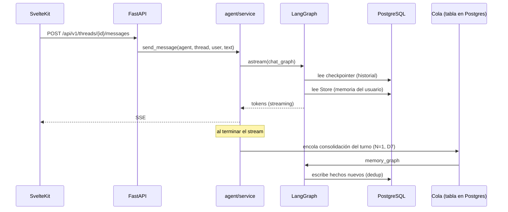

# Propuesta de Rewrite — de `theythink-ai` a `theyrethink-ai`

> Documento de diseño para reescribir la plataforma THEYTHINK AI reduciendo el código
> mantenido a mano, desacoplando la lógica del agente de la persistencia y separando
> backend de frontend. El proyecto actual (`theythink-ai`) se conserva como **referencia
> de features y datos**, no como base de código.
>
> Estado: **borrador para revisión** — D1, D3 y D6 resueltas (§14).

---

## 1. Resumen ejecutivo

El problema del proyecto actual no es Flask ni SQLite: es el **acoplamiento**. La lógica
del agente vive entrelazada con SQL (`basededatos.py`, ~1.700 líneas) y con HTTP
(`app.py`, ~1.060 líneas), y el frontend está dividido en 10 plantillas Jinja + 11
archivos JS + 6 archivos de i18n que duplican el mismo chat con distintas pieles.

El rewrite ataca eso con tres movimientos:

1. **Motor agéntico delegado a la librería** — LangChain + LangGraph desde el inicio,
   con un cliente LLM **OpenAI-compatible** y agnóstico de proveedor (A3 revisada, D15). La
   persistencia de conversación y la memoria pasan a ser features del runtime, no código
   propio.
2. **Base de datos real y asíncrona** — PostgreSQL con SQLModel + Alembic para las
   entidades de dominio, y los *checkpointer/store* de LangGraph para el estado del
   agente. Una sola instancia, sin convivir con la semántica de escritor único de SQLite.
3. **Frontend como una sola aplicación** — SvelteKit con un componente de chat central
   y tres *skins* (Web, WhatsApp, Telegram), contra un cliente TypeScript generado desde
   el OpenAPI del backend.

**Resultado esperado:** menos código propio en el núcleo agéntico (~500 → ~120 líneas y
sin esquema de sesiones/mensajes), un contrato backend↔frontend tipado, y una base
testeable sin base de datos ni red.

---

## 2. Objetivos y no-objetivos

### Objetivos

- Reducir el código de mantenimiento manual, sobre todo en sesiones, mensajes y memoria.
- Que la lógica del agente **no dependa de la base de datos** (ni de FastAPI, ni de la
  librería LLM).
- Separar backend y frontend con un contrato tipado end-to-end.
- **Memoria nativa:** todo agente nace con memoria persistente. No es una feature
  opcional ni algo que se active por configuración.
- Mantener paridad funcional con el proyecto actual (ver §10).
- Corregir de raíz los defectos de seguridad conocidos (ver §11).

### No-objetivos

- No construir un hexágono completo de puertos y adaptadores. Se usa **una sola costura
  fina**: el módulo de servicio del agente (§5.1). Menos ceremonia, mismo beneficio.
- No reescribir `agentes.db` a mano: se migra con script (§12, Fase 5).
- No añadir multi-agente/tools/RAG en la primera entrega (quedan como extensiones
  naturales del grafo, §13).

---

## 3. Decisiones de arquitectura (ADR resumido)

| # | Decisión | Alternativas descartadas | Razón |
|---|---|---|---|
| A1 | **FastAPI** | Flask, Django | Validación con Pydantic, async nativo, OpenAPI como contrato. |
| A2 | **PostgreSQL + SQLModel + Alembic** | SQLite + `aiosqlite` | SQLite es de escritor único; con FastAPI async es una incongruencia. Postgres da concurrencia real y un solo motor coherente. |
| A3 | **Cliente LLM OpenAI-compatible** (revisada, D15) | `langchain-deepseek` (elección original) | Un solo camino de código para cualquier proveedor, incluidos los de contexto de 1M. La elección original se hizo cuando 128K bastaba y el precio mandaba; hoy limita la flexibilidad. |
| A4 | **LangGraph desde el inicio** | LangChain a secas; grafo manual | El *checkpointer* + *Store* reemplazan la capa de sesiones/mensajes/memoria. Es el ahorro real de código. |
| A5 | **Persistencia del agente vía checkpointer/store de LangGraph** | Esquema propio de conversaciones | Elimina tablas y consultas manuales de historial. |
| A6 | **SvelteKit** | React, Vue/Nuxt, Astro | Ergonomía y bundle pequeño; los 3 canales son skins de un mismo componente. |
| A7 | **Rewrite en carpeta paralela** (`theyrethink-ai`) | Evolución in-place | El proyecto actual queda como referencia inmutable de features y datos. |
| A8 | **Costura fina, no hexágono** | Puertos/adaptadores formales | El objetivo es menos código; el grafo se encierra tras una función de servicio. |
| A9 | **Memoria por `(agente, usuario)`** | Memoria compartida por agente | Los hechos son sobre el usuario; aísla datos y escala mejor. Ver §5.3. |
| A10 | **Los 3 canales son siempre skins** | Comportamiento divergente por canal | Un `<Chat>` + 3 skins; sin ramas de comportamiento por canal. Ver §9.1. |

---

## 4. Stack técnico

### Backend

| Pieza | Elección |
|---|---|
| Framework | FastAPI + Pydantic v2 |
| ORM | SQLModel + Alembic (migraciones) |
| Base de datos | PostgreSQL (+ `asyncpg`) |
| Motor LLM | LangChain + LangGraph + cliente **OpenAI-compatible** (`langchain-openai` / `init_chat_model`); proveedor y modelo por configuración (A3 revisada, D15) |
| Memoria / estado | `langgraph-checkpoint-postgres` (`AsyncPostgresSaver`, `AsyncPostgresStore`) |
| Gestión de entorno | **`uv`** (Astral): `uv sync`, `uv add`, `uv run`. **Sin `pip`** ni `requirements.txt`; el pin vive en `uv.lock` versionado |
| Servidor | Uvicorn (workers) / Gunicorn+UvicornWorker |
| Auth | Sesión con cookie httpOnly (store en Postgres) + hashing Argon2 (D2) |
| Observabilidad | Logging estructurado; LangSmith opcional |

### Frontend

| Pieza | Elección |
|---|---|
| Runtime de tooling | **Deno**: `deno task`, `deno.json`, `deno.lock`. **Sin Node, npm, pnpm ni yarn** |
| Framework | SvelteKit con `adapter-static` en modo **SPA** (D8), servido por FastAPI (D4). *Fresh* (nativo de Deno) solo como plan B si la compatibilidad duele |
| Estilos | Tailwind (build de Vite, **no CDN**) |
| i18n | Paraglide (compile-time) o `svelte-i18n`; 6 idiomas: es, en, fr, pt, ko, zh |
| Cliente API | `openapi-typescript` + `openapi-fetch` generado desde `/openapi.json` (vía `npm:` de Deno) |
| Estado servidor | TanStack Query (o *load functions* de SvelteKit) |
| Lint / formato | **`deno lint`** y **`deno fmt`** (sustituyen a ESLint y Prettier) |

---

## 5. Núcleo del agente

### 5.1 La costura única

Todo el conocimiento de LangGraph vive detrás de un módulo de servicio. Los routers de
FastAPI y el resto del backend **no saben que existe LangGraph**: llaman funciones de
dominio. Si algún día se cambia de librería, solo se toca este módulo.

```
backend/app/agent/
├── service.py     # API pública del núcleo: send_message(), consolidate(), ensure_memory()
├── graph.py       # definición de los grafos LangGraph (chat y memoria)
├── llm.py         # fábrica del cliente LLM OpenAI-compatible (única puerta a la librería)
├── prompts.py     # construcción de system prompts — funciones puras, sin I/O
└── memory.py      # lectura/escritura del Store + política de deduplicación
```

- `prompts.py` es **Python puro**: recibe strings y devuelve un string. Testeable sin red
  ni base de datos. Es el heredero directo de `prompt.py` del proyecto actual.
- `service.py` es lo único que los routers importan.

### 5.2 El grafo: chat y memoria separados

Dos grafos comparten el mismo checkpointer y store. Separarlos permite que la
consolidación de memoria corra fuera del camino de respuesta del usuario (cola externa,
D7), sin bloquear la respuesta.

```python
# backend/app/agent/graph.py
from langchain_core.messages import BaseMessage
from langgraph.graph import StateGraph, START, END
from langgraph.graph.message import add_messages
from typing_extensions import Annotated, TypedDict


class AgentState(TypedDict):
    agent_id: int
    user_id: int
    thread_id: str
    messages: Annotated[list[BaseMessage], add_messages]
    system_prompt: str
    memories: list[str]


def build_chat_graph(llm, store):
    g = StateGraph(AgentState)
    g.add_node("load_context", load_context)   # rol + perfil + fuentes + memoria
    g.add_node("respond", make_respond(llm))
    g.add_edge(START, "load_context")
    g.add_edge("load_context", "respond")
    g.add_edge("respond", END)
    return g.compile(checkpointer=..., store=store)


def build_memory_graph(llm, store):
    g = StateGraph(AgentState)
    g.add_node("extract", make_extractor(llm))   # structured output
    g.add_node("persist", make_persister(store)) # dedup + store
    g.add_edge(START, "extract")
    g.add_edge("extract", "persist")
    g.add_edge("persist", END)
    return g.compile(checkpointer=..., store=store)
```

`build_chat_graph` se compila una vez en el *lifespan* de FastAPI y se reutiliza.
`build_memory_graph` se invoca como `BackgroundTask` al cerrar cada turno.

### 5.3 Memoria nativa desde el inicio

"Los agentes theythink vienen con memoria desde el inicio" se traduce en diseño a:

- **No existe un interruptor.** Cada agente tiene un *namespace* de memoria en el
  `Store`, y `load_context` **siempre** lo consulta e inyecta. La memoria es una
  propiedad intrínseca del agente, igual que su rol.
- **La inyección es transitoria y va al final del prompt.** El orden canónico es
  `[system][historial][memoria][mensaje nuevo]`. Los hechos se insertan como un bloque
  inmediatamente antes del mensaje nuevo, al construir el prompt, y **no se persisten** en el
  estado del hilo: si se persistieran, se repetirían en cada turno, inflarían el prompt y
  mostrarían recuerdos obsoletos. Además mantiene el prefijo `[system][historial]`
  byte-estable, que es lo que hace posible el ahorro de la caché (D7, §13).
- **Namespace (decidido, D1 y D6):** `("agent", str(agent_id), "user", str(user_id))`, donde
  `user_id` referencia la tabla `users` (usuarios autenticados, D6). Las etiquetas del `Store`
  de LangGraph tienen que ser **cadenas**: con enteros lanza `InvalidNamespaceError` (spike
  S2). Los hechos son sobre el usuario, así que la memoria se aísla por cuenta: dos usuarios
  que hablan con el mismo agente no comparten recuerdos. Los hechos globales del agente (si
  algún día se necesitan) vivirían en `("agent", str(agent_id), "shared")`, pero no forman
  parte del alcance inicial.
- **Extracción estructurada**, no el truco `NO_MEMORIA` parseado como texto:

```python
# backend/app/agent/memory.py
from pydantic import BaseModel


class MemoryFact(BaseModel):
    content: str
    category: str | None = None


class ExtractedMemories(BaseModel):
    facts: list[MemoryFact]
```

- **Deduplicación:** antes de persistir, se listan los hechos existentes del namespace y
  se descartan los equivalentes normalizados. La memoria deja de ser un blob de texto que
  crece y se reenvía entero: son elementos direccionables, con espacio para embeddings a
  futuro.
- **Agentes sembrados** pueden nacer con hechos iniciales (migrados del actual
  `agentes.memoria`), cumpliendo literalmente "memoria desde el inicio".

### 5.4 Fábrica LLM

```python
# backend/app/agent/llm.py
from functools import lru_cache
from langchain.chat_models import init_chat_model
from app.config import settings


@lru_cache
def get_llm(temperature: float = 0.7):
    """Única puerta a la librería LLM. Proveedor OpenAI-compatible por configuración."""
    return init_chat_model(
        settings.llm_model,              # p. ej. "openai:gpt-4.1" o "deepseek:deepseek-chat"
        base_url=settings.llm_base_url,  # cualquier endpoint OpenAI-compatible
        api_key=settings.llm_api_key,
        temperature=temperature,
        streaming=True,
    )
```

El modelo viene de configuración y **no se fija en el código**: D7 asume contextos de 1M de
tokens, así que la fábrica debe ser agnóstica de proveedor y de modelo, y el techo de
inyección debe derivarse del contexto real (ver §13).

Extracción de memoria con salida estructurada (sin parseo manual):

```python
extractor = get_llm(temperature=0).with_structured_output(ExtractedMemories)
```

### 5.5 Flujo de un turno



El usuario recibe la respuesta en streaming; la memoria se consolida después. Hoy esa
segunda llamada bloquea la respuesta (`app.py:976`).

---

## 6. Modelo de datos

Una sola base PostgreSQL, dos consumidores: las tablas de dominio (nuestras, vía
SQLModel/Alembic) y las tablas de LangGraph (de la librería, no se modelan a mano).

### 6.1 Dominio (nuestro)

```python
# backend/app/models/domain.py (esquema conceptual)
users            (id, username UNIQUE, email UNIQUE, password_hash, role, created_at)
roles            (id, key UNIQUE, name, description, prompt, is_system, created_at, updated_at)
agents           (id, name UNIQUE, profile, role_key, custom_identity, avatar_url, created_at)
knowledge_sources(id, name UNIQUE, content, created_at)
agent_sources    (agent_id FK, source_id FK, PRIMARY KEY(agent_id, source_id))   # N:M
threads          (id, agent_id FK, user_id FK, title, created_at, updated_at,
                  message_count, last_preview, last_consolidated_at)              # metadatos de hilo
```

Notas de diseño:

- **`agents.memory` desaparece.** La memoria vive en el `Store` de LangGraph.
- **`threads` es solo metadatos de UI.** El checkpointer guarda el estado completo, pero
  no es una tabla apta para listar conversaciones con título/preview. Esta tabla ligera
  cubre el dashboard y se mantiene desde el servicio.
- **No hay usuarios finales anónimos (D6).** Todo chat está autenticado contra `users`, y
  `threads.user_id` referencia esa tabla. WhatsApp y Telegram no aportan identidad propia:
  son skins (D3). Detalle de migración en §14.
- **`threads.last_consolidated_at` (D7)** es la marca de agua de consolidación: delimita la
  ventana de turnos a extraer y hace el trabajo idempotente aunque la cola entregue el
  mensaje más de una vez.
- `threads.id` es el `thread_id` que se pasa a LangGraph.
- Se eliminan: `conversaciones`, `sesiones_chat` (reemplazadas por checkpointer + threads)
  y la columna legacy `agentes.conocimiento` (absorbida por `knowledge_sources` + N:M).

### 6.2 LangGraph (de la librería)

Tablas gestionadas por `langgraph-checkpoint-postgres`: checkpoints, blobs, writes y las
del `Store`. Se crean con `await saver.setup()` / `await store.setup()` en el arranque.

---

## 7. Estructura de proyectos

```
~/code/
├── theythink-ai/                  # ACTUAL — referencia (solo lectura)
│   ├── app.py, basededatos.py, prompt.py, identidades.py, empresa.py, seed.py
│   └── templates/, static/
│
└── theyrethink-ai/                # REWRITE
    ├── backend/
    │   ├── app/
    │   │   ├── main.py            # app FastAPI, lifespan, CORS, routers
    │   │   ├── config.py          # pydantic-settings
    │   │   ├── db.py              # engine async + dependencia de sesión
    │   │   ├── models/            # tablas SQLModel
    │   │   ├── schemas/           # request/response Pydantic
    │   │   ├── api/
    │   │   │   ├── deps.py        # auth, autorización, paginación
    │   │   │   └── v1/            # auth, agents, roles, sources, threads, chat
    │   │   ├── agent/             # LA COSTURA (LangGraph vive aquí)
    │   │   │   ├── service.py
    │   │   │   ├── graph.py
    │   │   │   ├── llm.py
    │   │   │   ├── prompts.py
    │   │   │   └── memory.py
    │   │   ├── security/          # passwords, sesiones
    │   │   └── seed/              # datos canónicos portados desde theythink-ai
    │   ├── alembic/
    │   ├── scripts/
    │   │   └── migrate_from_sqlite.py
    │   ├── tests/
    │   ├── pyproject.toml
    │   └── .env.example
    ├── frontend/
    │   ├── src/
    │   │   ├── lib/
    │   │   │   ├── api/           # cliente generado desde OpenAPI
    │   │   │   ├── chat/          # <Chat/> core + skins (web/whatsapp/telegram)
    │   │   │   └── i18n/          # 6 idiomas
    │   │   └── routes/
    │   │       ├── (auth)/login/
    │   │       ├── admin/         # dashboard: agentes, roles, fuentes, usuarios
    │   │       ├── web/[agent]/
    │   │       ├── whatsapp/[agent]/
    │   │       └── telegram/[agent]/
    │   ├── package.json
    │   └── svelte.config.js
    ├── docker-compose.yml         # postgres (+ adminer opcional)
    ├── Makefile                   # just / make targets: dev, test, lint, migrate
    └── README.md
```

---

## 8. Contrato y API

- **Versionado:** todo bajo `/api/v1/...`.
- **Contrato:** el OpenAPI generado por FastAPI es la fuente de verdad. El frontend se
  regenera con `openapi-typescript`, así no hay deriva entre back y front.
- **Routers:** `auth`, `agents`, `roles`, `sources`, `threads`, `chat`.
- **Streaming (D5):** SSE para los tokens (`/api/v1/threads/{id}/messages`), **decidido**.
  WebSocket queda descartado mientras no aparezca necesidad real bidireccional.
- **Errores:** manejador centralizado que devuelve `{error, code, detail}` con forma
  estable. El manejo tipado de errores del proveedor LLM, portado del proyecto actual, se
  conserva.

---

## 9. Frontend (SvelteKit)

### 9.1 Un chat, tres skins

El insight de mayor ahorro: los tres canales comparten comportamiento y difieren en la
cáscara visual. El proyecto actual lo materializa como 3 plantillas + JS duplicado. Aquí:

```
lib/chat/
├── Chat.svelte          # lógica: mensajes, streaming, hilos, acciones
├── Composer.svelte      # input + envío
├── MessageBubble.svelte # burbuja base (slots para variantes)
└── skins/
    ├── WebSkin.svelte       # layout desktop, sidebar multi-hilo
    ├── WhatsappSkin.svelte  # viewport móvil, ✓✓, "escribiendo..."
    └── TelegramSkin.svelte  # teclado de comandos /start, /bases, /memoria
```

**Decidido (D3): los tres canales son siempre skins.** No hay comportamiento propio por
canal: los skins solo cambian la cáscara visual y ninguna lógica de conversación. `<Chat>`
expone *slots* y props de variante únicamente para personalización estética (colores,
composición, indicadores), no para ramificar flujo.

### 9.2 Rutas

`/web/[agent]`, `/whatsapp/[agent]`, `/telegram/[agent]` montan el skin
correspondiente. `/admin/*` para el dashboard. `/login` para auth.

### 9.3 i18n

Un solo sistema (Paraglide recomendado por ser compile-time y tree-shakeable) con las
claves actuales de `static/js/i18n*.js`. Se mantienen los 6 idiomas y la persistencia en
`localStorage`; el script anti-parpadeo de tema de `base.html` se traslada al layout de
SvelteKit.

---

## 10. Paridad de features (checklist de rescate)

| Feature actual | En el rewrite |
|---|---|
| CRUD de agentes (`app.py`, `basededatos.py`) | Routers `agents` + SQLModel |
| Roles/identidades sistema + custom (`identidades.py`, tabla `roles`) | Tabla `roles` + seed |
| Bases de conocimiento desacopladas y N:M (`fuentes_conocimiento`, `agente_fuentes`) | Tablas `knowledge_sources` + `agent_sources` |
| Sesiones multi-hilo (`sesiones_chat`, `conversaciones`) | `threads` + checkpointer LangGraph |
| Memoria activa (`agentes.memoria` + `agregar_memorias`) | `Store` de LangGraph, nativa, estructurada |
| Extracción por turno (2ª llamada bloqueante) | `memory_graph` en background |
| i18n 6 idiomas (`i18n*.js`) | Paraglide |
| Chat Web / WhatsApp / Telegram | `<Chat>` + 3 skins |
| Dashboard y transcripciones | `/admin/*` + `threads` |
| Auth + hashing (`verificar_usuario`) | Sesiones cookie + Argon2 |
| Sembrado canónico (`seed.py`, `empresa.py`, personajes) | `app/seed/` (datos portados) |
| Upload de avatar | Endpoint + almacenamiento local/S3 |
| Manejo de errores del proveedor LLM | Reutilizado/adaptado en la capa LLM |

---

## 11. Seguridad desde el día 1

Defectos del proyecto actual que el rewrite corrige por diseño:

- **Autorización real (RBAC).** Dependencia global de autenticación y un `require_admin`
  de verdad. Hoy la mayoría de los endpoints mutadores están abiertos
  (`POST /api/agentes`, `/perfil`, `/conocimiento`, `/identidad`, `/editar`, `/limpiar`,
  CRUD de `/api/fuentes`).
- **Sin secretos con fallback hardcodeado.** La `SECRET_KEY` es obligatoria (hoy
  `app.py:78` tiene fallback).
- **Subida de archivos restringida.** Sin `.svg` servido desde `static/` (hoy
  `app.py:82`), o saneado explícito.
- **CSRF en formularios / CORS configurado** de forma explícita, no implícita.
- **Rate limiting** en `/login`.
- **Servidor de producción.** Sin `debug=True` (hoy `app.py:1060`).
- **Logging estructurado** y manejador de errores centralizado.
- **Separación de configuración** por entorno (`pydantic-settings`), sin migrar/sembrar
  en el import (hoy `inicializar()` corre al importar `app.py:91`).

---

## 12. Plan de migración por fases

Cada fase tiene un criterio de "hecho" (DoD). Se trabaja en `theyrethink-ai`, leyendo
`theythink-ai` como referencia.

### Fase 0 — Andamiaje
Repo, `docker-compose` (Postgres), `pyproject.toml`, lint/format (`ruff`), `Makefile`,
CI (lint + tests), endpoint `/healthz`.

**DoD:** `make dev` levanta Postgres + FastAPI y `/healthz` responde 200.

### Fase 1 — Dominio y datos
Modelos SQLModel, Alembic inicial, CLI de seed con los datos canónicos portados desde
`identidades.py`, `seed.py` y `empresa.py`.

**DoD:** `alembic upgrade head` + `make seed` deja agentes, roles y fuentes listos.
Tests unitarios de modelos en verde.

### Fase 2 — Núcleo del agente
`llm.py`, `prompts.py` (portado de `prompt.py`), `graph.py`, `memory.py`, `service.py`.
Alta del checkpointer y del `Store` en el lifespan. Memoria nativa funcionando.
Consolidación por cola externa (D7).

**DoD:** test de `send_message()` con un LLM falso (sin red) que devuelve respuesta y
persiste/lee memoria; test de deduplicación. Cero I/O real en los tests.

### Fase 3 — API
Routers `/api/v1`, auth por cookie, RBAC, DTOs Pydantic, streaming SSE, manejo de errores
centralizado.

**DoD:** OpenAPI publicado; tests de contrato por endpoint (status, forma, autorización);
`/docs` navegable.

### Fase 4 — Frontend
SvelteKit sobre Deno (`adapter-static`, SPA), cliente TS generado, `<Chat>` + 3 skins,
i18n 6 idiomas, dashboard, login.

**DoD:** paridad de flujo login → dashboard → chat (los 3 skins) → logout, con tipos
end-to-end.

### Fase 5 — Migración de datos
`scripts/migrate_from_sqlite.py`: lee `agentes.db` y puebla el nuevo esquema + hilos +
memoria inicial en el Store.

**DoD:** migración idempotente verificada con un dump de referencia; checklist §10
completa.

### Fase 6 — Endurecimiento y corte
Rate limiting, CSRF, backups de Postgres y Redis, logging, servidor de producción,
despliegue.

**DoD:** checklist §11 cumplido; `theythink-ai` queda archivado como referencia.

### Fase 7 — Extensiones (opcional, cuando aporte)
Debate multi-agente (el grafo ya lo soporta), tool calling, RAG denso/disperso sobre el
`Store`.

---

## 13. Riesgos y mitigaciones

| Riesgo | Mitigación |
|---|---|
| La librería se vuelve tu arquitectura; churn de LangChain/LangGraph | Fijar versiones exactas; encerrar todo tras `agent/service.py` para que un cambio de librería no toque routers |
| Depuración difícil (errores dentro del grafo) | Logging estructurado de estado; LangSmith opcional |
| Memoria sin selección → prompt creciente (D7) | Costo y latencia suben con la memoria | Techo de `0.4 × contexto`; métrica de tokens inyectados; compactación y dedup semántica si se acerca al techo |
| **Caché de prompt desperdiciada** (D7) | Un *cache miss* cuesta del orden de 10× un *cache hit* | Memoria al final **y transitoria**; prefijo `[system][historial]` byte-estable; nada volátil al inicio; hechos en orden de inserción |
| Superficie operativa | Una sola pieza: Postgres (dominio + checkpointer + cola, D14) | `docker-compose` para dev; backups en Fase 6 |
| Disciplina async (bloquear el loop con código sync) | Cliente LLM async, `asyncpg`, sesiones async; revisar que ningún `async def` llame código bloqueante |
| Expectativa de "menos código" mal calibrada | El mayor ahorro está en el frontend y en el núcleo de sesiones/memoria; el CRUD de dominio y el dashboard siguen siendo código propio |
| Pérdida de datos en la migración | Script idempotente + fixtures sintéticas + verificación contra dump (§12 F5, plan de desarrollo §5) |

---

## 14. Decisiones

### Resueltas

- **D1 — Alcance de la memoria → por `(agente, usuario)`.** Namespace
  `("agent", str(agent_id), "user", str(user_id))`. Dos usuarios del mismo agente no
  comparten recuerdos. Desarrollado en §5.3.
- **D2 — Autenticación → cookie de sesión httpOnly**, con store en Postgres (revocable).
  JWT descartado para v1. Con D4 no hace falta CORS.
- **D3 — Divergencia de canales → los 3 canales son siempre skins.** Sin comportamiento
  propio por canal. Desarrollado en §9.1.
- **D4 — Despliegue → mismo origen.** FastAPI sirve `/api/v1` y el frontend: sin CORS y con
  cookies/CSRF simplificados.
- **D5 — Streaming → SSE**, decidido para v1. WebSocket descartado mientras no aparezca
  necesidad real bidireccional.
- **D6 — Identidad del usuario → una sola tabla `users`.** Campos `username`, `email` y
  `password_hash` (Argon2), confirmados; se conservan los roles `admin` y `usuario`
  (`require_admin`, §11). No hay usuarios finales anónimos ni identidades por canal:
  WhatsApp y Telegram son vistas del mismo frontend autenticado (coherente con D3).
  `threads.user_id` y el namespace de memoria apuntan a `users.id`. Contrapartida aceptada:
  dos personas que compartan una cuenta comparten memoria.
  **Notas de migración:** la tabla `usuarios` actual no tiene `email` (se sintetiza en el
  migrador) y usa el hash de Werkzeug (`scrypt`, vía `generate_password_hash`), que se
  re-hashea a Argon2 en el primer login exitoso.
- **D7 — Consolidación de memoria → `N=1`, sin selección, techo del 40% del contexto.**
  1. *Disparador:* **un turno (`N=1`)** — se consolida en cada turno, asumiendo el costo 2×.
     `N` queda como palanca de costo en configuración, no como lógica adaptativa.
  2. *Inyección:* **sin selección** por defecto — todos los hechos del namespace — con techo
     `0.4 × contexto_del_modelo`, calculado en runtime (§13).
  3. *Durabilidad:* **cola en Postgres**, no `BackgroundTask`: tabla propia con
     `SELECT ... FOR UPDATE SKIP LOCKED`, encolada **en la misma transacción que el turno**
     (D14). La marca de agua `threads.last_consolidated_at` delimita la ventana y hace la
     consolidación idempotente ante reintentos.
  4. *Caché:* orden canónico del prompt **`[system][historial][memoria][mensaje nuevo]`**.
     La memoria se inyecta **al final, inmediatamente antes del mensaje nuevo**, y de forma
     **transitoria** (no se persiste en el estado del hilo). Así el prefijo
     `[system][historial]` queda byte-estable y cacheable, y solo se re-factura el tramo
     final. Desarrollado en §13.
- **D8 — Modo de SvelteKit → SPA** con `adapter-static`, servido por el mismo origen (D4).
  Deno queda **solo en tiempo de build**; el runtime es FastAPI sirviendo estáticos.
- **D9 — Librería i18n → Paraglide JS** (`@inlang/paraglide-js`, v2), *compile-time* y
  *tree-shakeable*, con los mensajes en `messages/{locale}.json` y la locale persistida en
  `localStorage`. Desarrollado en §9.3 y ADR `0019`.
- **D10 — Semántica de borrado.** Borrar un hilo ⇒ checkpoint + fila `threads`; **no** toca
  el `Store`. "Olvidar memoria" es endpoint aparte y explícito.
- **D11 — BD de test → esquema efímero por sesión** sobre el Postgres de `docker-compose`.
- **D12 — Almacenamiento de avatar → local**, en un directorio fuera de lo servido como
  estático (volumen propio, servido por endpoint con `Content-Disposition`, sin SVG).
- **D13 — Alta de usuarios → registro público.** Cualquiera puede registrarse; el primer
  `admin` se siembra en Fase 1 y las cuentas siguientes nacen con `role = 'usuario'`. Implica
  endpoint de registro con validación de unicidad de `username` y `email` en Fase 3, y el
  endurecimiento correspondiente (rate limiting, política de contraseña, y verificación de
  email o captcha si el abuso lo exige) en Fase 6.
- **D14 — Tecnología de la cola de consolidación → tabla en Postgres** con
  `SELECT ... FOR UPDATE SKIP LOCKED`. Ventaja decisiva: **el encolado ocurre en la misma
  transacción que el turno**, así que no hay forma de perderlo ni duplicarlo, y no se suma un
  servicio más que operar. Descartadas: `arq` + Redis (mejor latencia, pero un servicio más y
  encolado no transaccional), `pgmq` (válida, evita código propio) y el barrido sin cola.
- **D15 — Cliente LLM → proveedor y modelo por variables de entorno**, sobre API
  **OpenAI-compatible** (`base_url`, `api_key`, `model`). Revisa A3. Condiciones que debe
  cumplir el modelo elegido:
  - Contexto amplio (1M deseable): el techo de memoria es `0.4 × contexto`.
  - **Caché de prompt por prefijo**, con descuento relevante en *cache hit*.
  - Streaming de tokens.
  - Salida estructurada o *tool calling* (para el extractor de memoria).
  - Poder insertar mensajes de rol `system` en medio del array (requisito de la inyección de
    memoria al final, D7) o una alternativa equivalente.
  - Calidad multilingüe en los 6 idiomas soportados (es, en, fr, pt, ko, zh).
  - Concurrencia suficiente para chat en streaming + extracción en background.
- **D16 — Lectura del historial de un hilo → `GET /api/v1/threads/{id}/messages`.** El
  transcript se lee del **checkpointer** a través de `agent/service.py` (DTOs de dominio),
  nunca con SQL propio (`AGENTS.md` §3.3). Solo se exponen los mensajes `user`/`assistant`:
  el `system_prompt` y la memoria inyectada no son conversación (D7). Necesario para reanudar
  un hilo en la UI y para las transcripciones del dashboard. Ver ADR `0020`.
- **D17 — Gestión de usuarios → router `users` solo para administradores.** El dashboard
  necesita algo más que el registro público (D13): listar, crear, editar (nombre, correo, rol
  y contraseña) y borrar cuentas. Todo endpoint mutador exige `require_admin`, la contraseña
  se hashea con Argon2 y nunca se expone. Salvaguardas contra el auto-bloqueo: un
  administrador **no** puede eliminarse ni degradar su propio rol (409). Unicidad de
  `username`/`email` ⇒ 409. Ver ADR `0021`.
- **D18 — Vista admin de transcripciones → router `admin` solo para administradores.**
  `GET /api/v1/admin/threads` (todas las conversaciones, con nombre de agente y de usuario,
  filtro opcional por agente) y `GET /api/v1/admin/threads/{id}/messages`. El transcript se
  lee del **checkpointer** vía `agent/service.py` (D16), nunca con SQL propio. Es la vista de
  auditoría del dashboard; el router de usuario (`/threads`) sigue limitado a la pertenencia.
  Ver ADR `0021`.
- **D19 — Edición del perfil propio → `PATCH /api/v1/auth/me`.** El usuario autenticado puede
  actualizar su `username`, su `email` y su contraseña. Cambiar la contraseña exige la
  contraseña actual (`current_password`); la nueva se hashea con Argon2. Unicidad ⇒ 409.
  No permite cambiar el propio rol (eso es D17). Ver ADR `0021`.

### Abiertas

Ninguna. Todas las decisiones registradas están resueltas.

---

## 15. Definición de "Hecho" global

Un cambio se considera terminado cuando: respeta las decisiones de §3, tiene tests
(unitarios del núcleo sin I/O + contrato de endpoints), pasa lint en CI, no introduce
secretos ni endpoints mutadores sin autorización, y no filtra detalles de LangGraph fuera
de `agent/`.

---

*Propuesta mantenida por el equipo de THEYTHINK. Actualizar al cerrar cada fase y cada
decisión abierta.*
